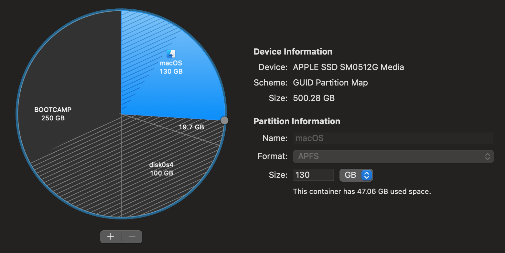

# macbookpro-arch-install
Install Arch Linux on MBP 11,5


## Resources:
- <a href="https://wiki.archlinux.org/title/MacBookPro11,x">https://wiki.archlinux.org/title/MacBookPro11,x</a>


## Partition Disks in MACOS
- In MacOS, open `Disk Util`.
- Shrink the MacOS partition to create free disk space.
- Add a partition for the root mount and swap as `FAT` or `ExFAT` format. They will be reformatted in Arch later.



## Create Bootable USB

Download the latest Arch ISO from here: <a href="https://mirror.arizona.edu/archlinux/iso/latest/">https://mirror.arizona.edu/archlinux/iso/latest/</a>

Copy it to USB:
```
dd if=archlinux-image.iso of=/dev/rsdX status=progress bs=1M
```

Keep the USB with Arch plugged in. Reboot and hold `option` key to be able to select USB bootloader.

## Format Partitions

Once booted into the USB Arch, partition and format using fdisk. Ref: <a href="https://www.oueta.com/linux/installing-arch-linux-on-a-macbook-or-other-uefi-systems/">https://www.oueta.com/linux/installing-arch-linux-on-a-macbook-or-other-uefi-systems/</a>

```
# fdisk /dev/sda


Command (m for help): n
Partition number (3-128, default 3):
First sector (227543040-236978142, default 227543040):
Last sector, +/-sectors or +/-size{K,M,G,T,P} (227543040-236978142, default 236978142):

Created a new partition 3 of type 'Linux filesystem' and of size 4.5 GiB.

Command (m for help): type
Selected partition 3
Partition type (type L to list all types): 19
Changed type of partition 'Linux filesystem' to 'Linux swap'.

Command (m for help): w
The partition table has been altered.
Syncing disks.
```

We need one `Linux filestytem` and one `Linux swap` formatted partitions. Write and exit when done.

On Swap:
```
mkfs.vfat -F32 /dev/sda3
```
On root:
```
mkfs.ext4 /dev/sda4
```

## Mount Disks

```
# mount /dev/sda4 /mnt
# mount /dev/sda1 /mnt/boot
# swapon /dev/sda3
# pacstrap -i /mnt base base-devel

```

#### Generate fstab
```
# genfstab -U /mnt >> /mnt/etc/fstab
```

#### Chroot
```
# arch-chroot /mnt
```

## Install base packages
```
pacman -S base-devel linux-headers tree linux-lts linux-lts-headers
```

## Generate Locale
- Run `locale-gen` to create the `/etc/locale.gen` file.
- Edit `/etc/locale.gen` and uncomment the en_US.UTF-8 line.
- Run `locale-gen` again.

## Add User

```
useradd --create-home --groups wheel --shell /bin/bash <username>
passwd <username>
```

To ensure this new user can execute sudo commands, use `visudo` and uncomment the following line:
```
%wheel ALL=(ALL) ALL
```

## Add WIFI
Install `iwd`.
```
pacman -S iwd
```

Now its possible to scan and connect to WIFI. To list available APs:
```
# iwctl
[iwd]# station wlan0 get-networks
```
Use the following script to connect to a WIFI AP.
```
#!/bin/bash

iwctl --passphrase $WIFI_PASS station wlan0 connect <wifi_name>
```

## Compile linux-macbook kernel
Normal Boot would freeze on the login prompt. Compiling and using this kernel fixed this.

Resize `tmp` to have enough space for downloading and building.

<a href="https://archlinuxarm.org/forum/viewtopic.php?f=57&t=8812#p46812">https://archlinuxarm.org/forum/viewtopic.php?f=57&t=8812#p46812</a>
```
# mount -o remount,size=30G,noatime /tmp
```

Adjust swap/memory cleanup aggressiveness. This seemed to solve swap/memory filling up until failure.

<a href="https://wiki.manjaro.org/index.php/Swap">https://wiki.manjaro.org/index.php/Swap</a>
```
# sysctl vm.swappiness=85
# sysctl vm.vfs_cache_pressure=150
```

Monitor memory usage
```
$ free -h
$ df -h
```


## Add yoart

Ref: <a href="https://www.tecmint.com/install-yaourt-in-arch-linux/">https://www.tecmint.com/install-yaourt-in-arch-linux/</a>
```
$ sudo pacman -S --needed base-devel git wget yajl
$ cd /tmp
$ git clone https://aur.archlinux.org/package-query.git
$ cd package-query/
$ makepkg -si && cd /tmp/
$ git clone https://aur.archlinux.org/yaourt.git
$ cd yaourt/
$ makepkg -si
```

## Install linux-macbook kernel

Add the `skippgpcheck` Make argument (--m-arg). Skipping signature checks is needed because the source has migrated to Github and sigs fail now. Note that this will take at least a couple of hours.
```
# su msx
$ yaourt -S linux-macbook --m-arg --skippgpcheck
```

When prompted to edit PKGBUILD when prompted, choose `YES` and change the 2 instances of:
```
git.archlinux.org/linux.git/...
```
to:
```
github.com/archlinux/linux.git/...
```


## Setup Bootctl
This will copy kernels and `.img` over to the boot partition. It will make `systemd-boot` the default bootloader. `rEFInd` is better; see below for `rEFInd`.
```
# bootctl --path=/boot install
```

## Setup rEFInd

This will make rEFInd the default bootloader
```
# refind-install
```

Edit the rEFInd configs. List device partition UIDs if needed: `ls -lah /dev/disk/by-partuuid/`.

<b>/boot/refind_linux.conf</b>
```
"Boot with standard options"  "root=PARTUUID=<partuuid> rw add_efi_memmap initrd=initramfs-linux-macbook.img"
```

<b>/boot/EFI/refind/refind.conf</b>

- Find the `menuentry` for `Arch Linux`.
- Remove `disabled` from the entry
- Change the PARTUUIDs to be accurate (`ls -lah /dev/disk/by-partuuid/`)
- Change `initrd` and `loader` to `vmlinux-linux-macbook`

The result should be similar to the following:
```bash
menuentry "Arch Linux" {
  icon     /EFI/refind/icons/os_arch.png
  volume   "Arch Linux"
  loader   vmlinux-linux-macbook
  initrd   initramfs-linux-macbook.img
  graphics on
  options  "root=PARTUUID=<partuuid> rw add_efi_memmap"
  submenuentry "Boot using fallback initramfs" {
    initrd initramfs-linux-fallback.img
  }
  submenuentry "Boot to terminal" {
    add_options "system.unit=multi-user.target"
  }
}

```
